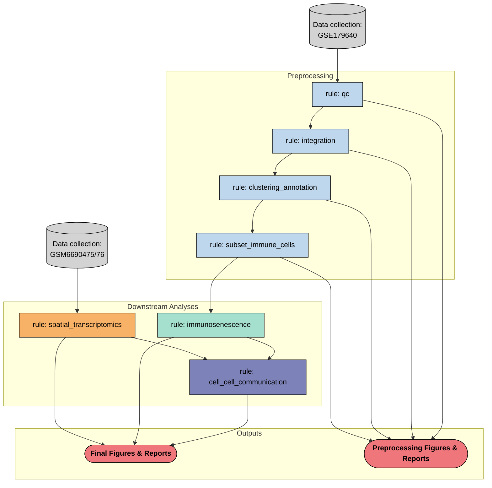

# endo-immune-atlas

A reproducible Snakemake pipeline for spatial immune and immunosenescence profiling in endometriosis using public single-cell and spatial transcriptomics data.

---

## Background

Endometriosis affects approximately 1 in 10 women of reproductive age and is characterized by the growth of endometrial-like tissue outside the uterus. Despite its prevalence, the immune landscape of endometriotic lesions remains poorly characterized at single-cell resolution. This project integrates scRNA-seq and spatial transcriptomics to map immune cell states, with a focused analysis on immunosenescence  the acquisition of a senescent phenotype by immune cells  within ectopic, eutopic, and healthy endometrial tissue.

---

## Biological Questions

1. How do immune cell states differ across ectopic, eutopic, and healthy endometrium?
2. Are immunosenescent populations enriched in endometriotic lesions?
3. How do senescence-high immune cells spatially organize within the lesion microenvironment?
4. What ligand-receptor interactions are enriched between senescent immune cells and other cell types in the lesion niche?

---

## Datasets

| Accession | Type | Description |
|---|---|---|
| GSE179640 | scRNA-seq | Ectopic, eutopic, and healthy endometrium (Tan et al.) |
| GSM6690475 / GSM6690476 | Visium ST | Ectopic endometriosis lesion tissue sections |

---

## Pipeline Overview

This project is built as a modular Snakemake pipeline. Each analysis step is an independent rule with defined inputs, outputs, and parameters controlled via `config/config.yaml`.

```
endo-immune-atlas/
 config/
    config.yaml
 workflow/
    Snakefile
    rules/
        qc.smk
        integration.smk
        clustering_annotation.smk
        subset_immune_cells.smk
        immunosenescence.smk
        spatial_transcriptomics.smk
        cell_cell_communication.smk
 scripts/
    01_endo_immune_atlas_data_collection.py
    02_endo_immune_atlas_qc.py
    03_endo_immune_atlas_integration.py
    04_endo_immune_atlas_total_clustering.py
    05_endo_immune_atlas_subset_clustering.py
    06_endo_immune_atlas_immunosenescence.py
    07_endo_immune_atlas_spatial_transcriptomics.py
    08_endo_immune_atlas_cellular_communication.py
 notebooks/          # exploratory analysis only
 data/
    raw/            # GEO downloads  not tracked by git
    processed/      # pipeline intermediates  not tracked by git
 results/
    preprocessing/  # QC plots, UMAPs, cluster markers
    figures/        # final analysis figures
 envs/
    endo_env.yaml
 .gitignore
 README.md
```

### DAG



---

## Notebook Outline

| Notebook | Tools | Description |
|---|---|---|
| 01_data_collection | AnnData | Data loading, AnnData generation, sample labeling |
| 02_qc | Scanpy | Cell filtering, doublet removal |
| 03_integration | Scanpy, harmonypy | Normalization, HVG selection, PCA, Harmony |
| 04_total_clustering | Scanpy, CellTypist | UMAP, broad cell type annotation |
| 05_subset_clustering | Scanpy, CellTypist | Immune subset, fine-resolution clustering |
| 06_immunosenescence | Scanpy | Senescence scoring, SEN-high/low populations, DEG |
| 07_spatial_transcriptomics | cell2location | Visium deconvolution, spatial immune mapping |
| 08_cellular_communication | LIANA+ | Spatially-anchored ligand-receptor inference |

---

## Tools & Environment

| Tool | Purpose |
|---|---|
| Snakemake | Pipeline workflow management |
| Scanpy | scRNA-seq processing and clustering |
| AnnData | Data object format |
| harmonypy | Batch correction |
| CellTypist | Automated cell type annotation |
| cell2location | Spatial deconvolution |
| LIANA+ | Cell-cell communication inference |
| Squidpy | Spatial transcriptomics analysis |

### Setup

```bash
# clone the repo
git clone https://github.com/taimcnugget/endo-immune-atlas.git
cd endo-immune-atlas

# create the conda environment
conda env create -f envs/endo_env.yaml
conda activate endo_pipeline

# download data from GEO
# GSE179640: https://www.ncbi.nlm.nih.gov/geo/query/acc.cgi?acc=GSE179640
# GSM6690475: https://www.ncbi.nlm.nih.gov/geo/query/acc.cgi?acc=GSM6690475
# GSM6690476: https://www.ncbi.nlm.nih.gov/geo/query/acc.cgi?acc=GSM6690476
# place downloaded files in data/raw/ following the structure in config/config.yaml

# dry run to verify pipeline
snakemake -n

# run the full pipeline
snakemake --cores 4
```

---

## Status

 Under active development

---

## Future Directions

*To be completed after analysis. This section will document follow-up experiments and biological questions arising from the results.*

---

## Author

Tailynn Y. McCarty, PhD
Computational Immunology | Women's Health  
[LinkedIn](www.linkedin.com/in/tailynn)  [GitHub](github.com/taimcnugget)
